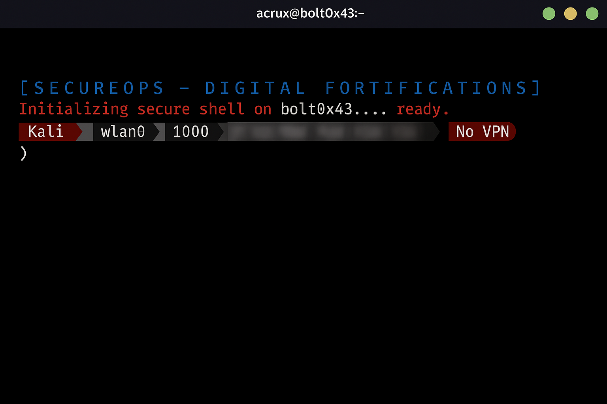
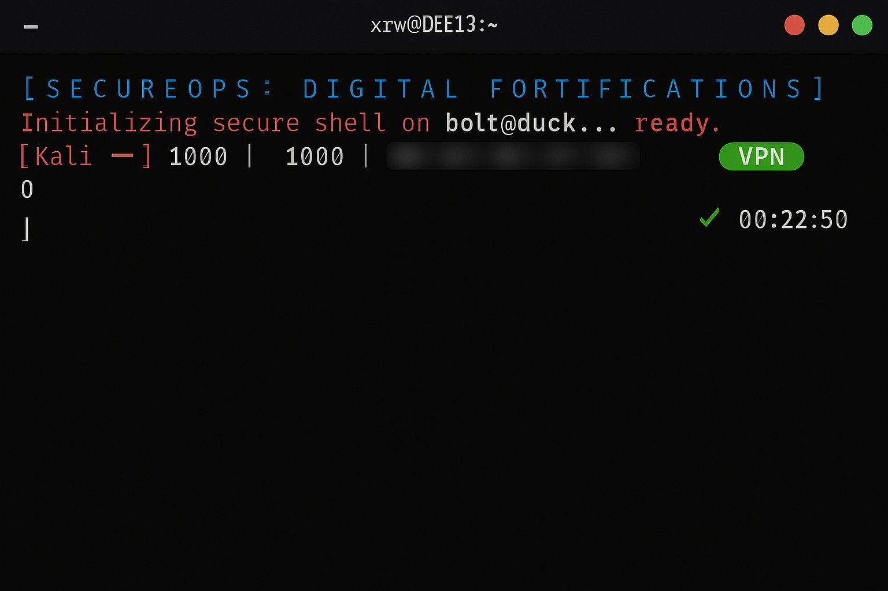
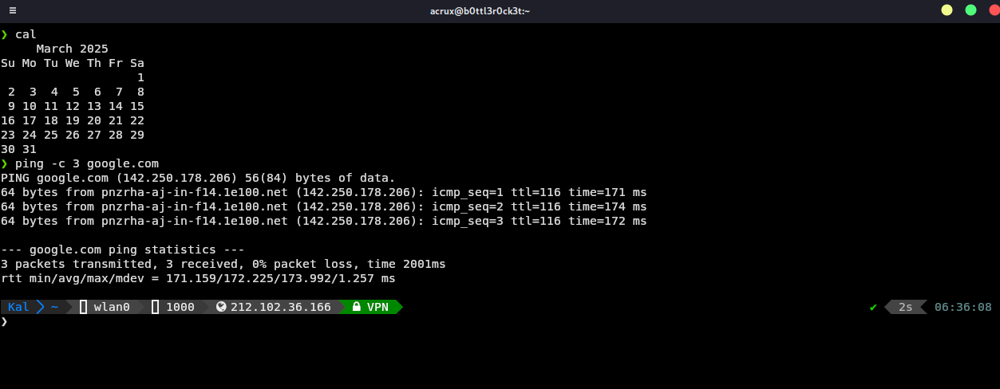

# 🛡️ SecureOps Shell

A custom hacker-themed terminal experience for Kali Linux, designed by Mark Gustafson. SecureOps Shell includes a beautiful Powerlevel10k prompt, VPN awareness, dynamic IP visibility, interface detection, and a slick digital fortress greeting every time you launch your terminal.





---

## ⚙️ Features

- Custom ASCII art banner on launch: `[ S E C U R E O P S -  D I G I T A L   F O R T I F I C A T I O N S ]`
- Powerlevel10k with:
  - Interface name (e.g. wlan0)
  - User ID (optional to remove)
  - Private and Public IP
  - VPN Status 🔐 (green if VPN on, red if not)
- Command execution time and status indicator
- Kitty terminal emulator for best-in-class visuals and performance
- Fun hacker-style startup messages
- Modern Zsh configurations with autojump, aliases, and segment styling
- **No background image** — we decided to keep it clean and minimal

---

## 🚀 Installation

```bash
git clone https://github.com/Minima1vi6es/SecureOps-Shell.git
cd SecureOps-Shell
chmod +x install.sh
./install.sh
```

This will:

1. Install Kitty and set it as your default terminal emulator.
2. Copy `.zshrc` and `.p10k.zsh` to your home directory.
3. You may need to restart your terminal or run `source ~/.zshrc`.

---

## 🧼 Uninstallation

```bash
chmod +x uninstall.sh
./uninstall.sh
```

You’ll be prompted whether to remove Kitty and your config files.

---

## 📁 Project Structure

```
SecureOps-Shell/
├── .zshrc
├── .p10k.zsh
├── install.sh
├── uninstall.sh
├── README.md
└── screenshots/
    ├── launch_no-vpn.png
    ├── launch_vpn-on.png
    └── sample_commands.png
```

---

## 👨‍💻 Author

**Mark Gustafson**  
Founder, Digital Fortifications Group LLC  
📫 markgustafson@digitalfortificationsgroup.com  
🌐 [portfolio.digitalfortificationsgroup.com](http://portfolio.digitalfortificationsgroup.com)  
🔗 [LinkedIn](https://www.linkedin.com/in/mark-gustafson773)

---

## 🎧 Other Fun Stuff

🎵 [SoundCloud (acruxtek)](https://soundcloud.com/acruxtek)  
🎸 [Tomorrow Fades Away - Spotify](https://open.spotify.com/artist/0luRm1nJFVg9yfSS8jtOME?si=QWHRJ7PQQNiPwQdUHCMhUQ)

---

## 🪪 License

This project is licensed under the [MIT License](https://opensource.org/licenses/MIT).
